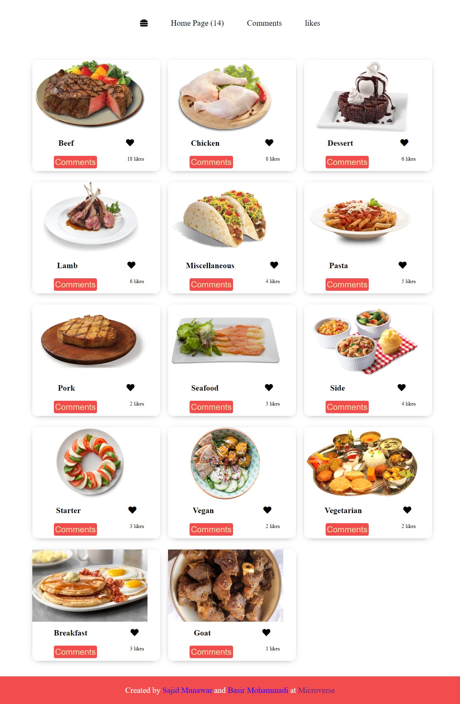
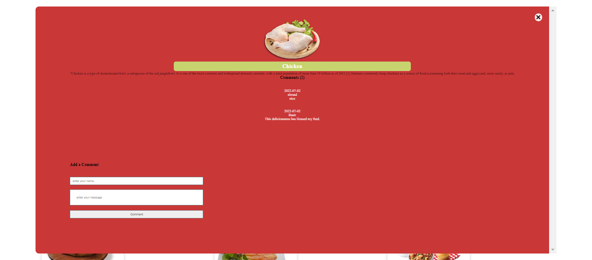

# Resturant Website Application

> This is a website that allows users to look, like and comment on their favourite meal.

## Built With

- HTML
- Bootstrap
- JavaScript
- Webpack
- APIs
- Linters

## Getting Started

To get a local copy up and running follow these simple example steps.

- Clone repository in your local machine 
- cd Leaderboard
- open `index.html` in your browser.
- You can use live server.

## Application Screen Shots

#### Homepage

#### PopupWindow

## Live Demo

[Todo Live](https://sajid-munawar.github.io/Capstone_Javascript/)

## Authors

👤 **Sajid Munawar**

- GitHub: [@githubhandle](https://github.com/sajid-munawar)
- LinkedIn: [LinkedIn](https://www.linkedin.com/in/sajid-munawar-41ba26180/)

👤 **Basir Mohammadi**

- GitHub: [@githubhandle](https://github.com/Basir-Mohammadi)
- LinkedIn: [LinkedIn](https://www.linkedin.com/in/basir-mohammadi-1296b3157/)

## 🤝 Contributing

Contributions, issues, and feature requests are welcome!

Feel free to check the [issues page](https://github.com/sajid-munawar/Capstone-Javascript/issues)

## Show your support

Give a ⭐️ to if you like this project!

## Acknowledgments

- Microverse
- Inspiration
- etc

## 📝 License

This project is [MIT](./MIT.md) licensed.

